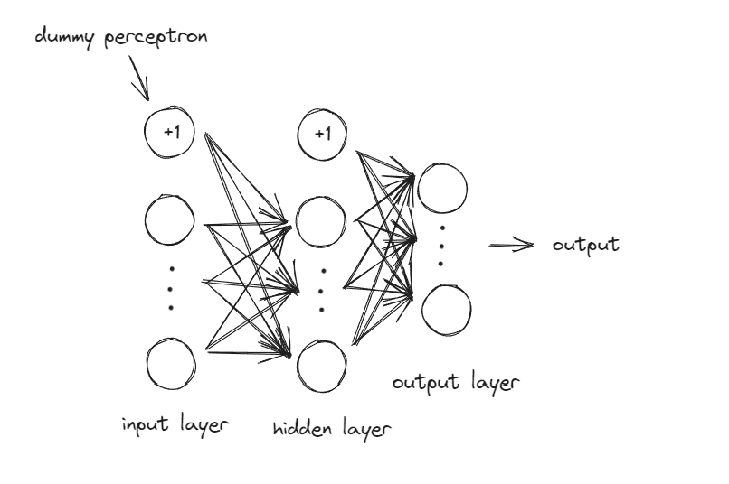

## 多层感知机(Multi Layer Perceptron, MLP)

多层感知机（Multilayer Perceptron, MLP）是一种前馈神经网络，由多个全连接层（fully connected layers）组成， 是最基本的神经网络架构之一。

MLP 在机器学习和深度学习中被广泛用于处理结构化数据、分类、回归等任务。

### 结构

- **输入层**：直接接收数据的输入。每个节点（neuron）对应一个输入特征，节点数与输入特征数相同。

- **隐藏层**：位于输入层和输出层之间的层，MLP 至少包含一个隐藏层，每层的每个神经元都会接收前一层所有神经元的输入，通过加权求和和激活函数转换。

- **输出层**：输出最终的预测结果，节点数一般与任务相关，比如分类问题中节点数等于类别数，回归问题中节点数等于目标值的数量。

在该目录中，我们实现了一个包含一个隐藏层的简单感知机，其基本结构如下图所示：

在`MLP_np.py`中，完成了该感知机的初始化与训练，使其能够完成再 MNIST 数据集上的分类任务。