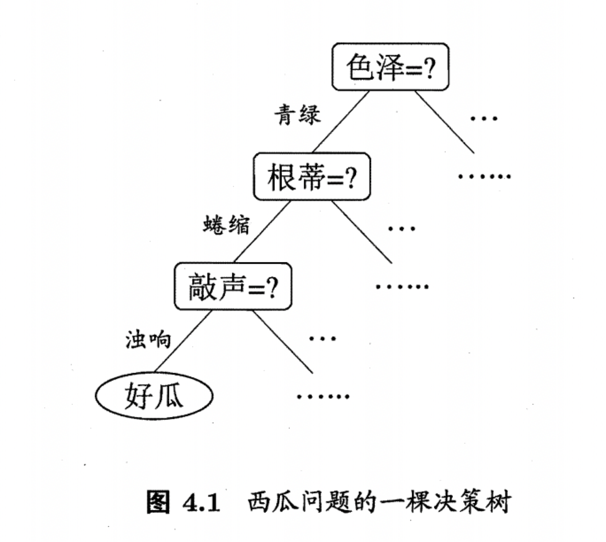

## 简介

> 决策树(decision tree) 是一类常见的机器学习方法.以二分类任务为例，我们希望从给定训练数据集学得一个模型用以对新示例进行分类，这个把样本分类的任务，可看作对"当前样本属于正类吗?"这个问题的"决策"或"判定"过程.顾名思义，决策树是基于树结构来进行决策的，这恰是人类在面临决策问题时一种很自然的处理机制.例如，我们要对"这是好瓜吗?"这样的问题
>
> 进行决策时，通常会进行一系列的判断或"子决策"我们先看"它是什么颜色?"，如果是"青绿色"，则我们再看"它的根蒂是什么形态?"，如果是"蜷缩"，我们再判断"它敲起来是什么音?"，最后?我们得出最终决策:这是个好瓜.这个决策过程如图 4.1 所示.
>
> 

决策树模型会根据**特征选择依据**(信息熵)等划分特征，生成决策树，然后**剪枝**提高泛化能力，可分类可回归，代表算法有ID3，C4.5和CART

## 决策树生成算法

|      | 特征选择依据 |      |
| :--: | :----------: | ---- |
| ID3  |    信息熵    |      |
| C4.5 |  信息增益比  |      |
| CART |   基尼系数   |      |

## 信息增益

首先理解一个概念：信息熵

**熵在化学中是表示分子的混乱程度，分子越混乱，它的熵就越大，而若分子越有序，熵值就越小**。

信息熵也是一样的，它能对信息的不确定性进行恒量，如果某个信息让我们的判断更加有序，清晰，则它信息熵越小，反之越大。
$$
H(X)=-\sum_{i=1}^{n} p\left(x_{i}\right) \log p\left(x_{i}\right)
$$
其中$p(x_i)$代表时间$X$为$x_i$的概率,推导如下：

还有一个概念是条件熵，**在x取值一定的情况下随机变量y不确定性的度量**
$$
H(Y \mid X)=\sum_{x \in X} p(x) H(Y \mid X=x)
$$
信息增益就是熵和特征条件熵的差，$g(D,A)=H(D)－H(D|A)$，对一个确定的数据集来说，H(D)是确定的，那H(D|A)在A特征一定的情况下，随机变量的不确定性越小，信息增益越大，这个特征的表现就越好

## 信息增益比

在信息增益的基础上除A特征的熵是因为信息增益偏向于选择取值较多的特征，容易过拟合。所以引进信息增益比
$$
g_{R}(D, X)=\frac{g(D, X)}{H_{X}(D)}
$$

## 基尼指数

基尼指数的定义如下：
$$
\operatorname{Gini}(D)=\sum_{k=1}^{K} \sum_{k^{\prime} \neq k} p_{k} p_{k^{\prime}}=1-\sum_{k=1}^{K} p_{k}^{2}
$$
其中$p_{k}=\frac{\left|C_{k}\right|}{|D|}$是数据集中 𝑘类样本的比例，所以有：
$$
\operatorname{Gini}(D)=1-\sum_{k=1}^{K}\left(\frac{\left|C_{k}\right|}{|D|}\right)^{2}
$$
基尼指数就是从数据集D中随机抽取两个样本，其类别不同的概率，基尼指数越小，说明数据集D中的相同类别样本越多，纯度越高。

将基尼指数按属性a（特征）来划分，则其基尼指数为：
$$
\operatorname{Gini}(D, a)=\sum_{v=1}^{V} \frac{\left|D^{v}\right|}{|D|} \operatorname{Gini}\left(D^{v}\right)
$$

## 优缺点

优点：计算复杂度不高，输出结果易于理解，对中间值的缺失不敏感，可以处理不相关特征数据。

缺点：可能会产生过度匹配问题

适用数据类型：数值型和标称型