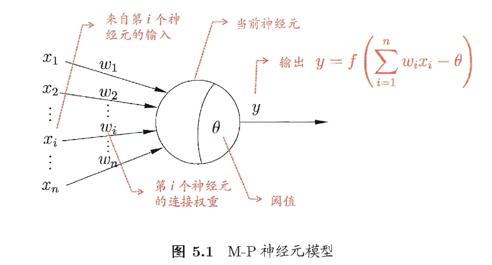

## 神经元模型

神经网络中最基本的成分是神经元模型，即上述定义中的“简单单元”。在生物神经网络中，每个神经元与其他神经元相连，当它“兴奋”的时候，就会向相连的神经元发送化学物质，从而改变这些神经元内的电位；如果某神经元的电位超过了一个阈值，那么它就会被激活，即“兴奋”起来，向其他神经元发送化学物质。




上图中的神经元接收到来自n个其他神经元传递过来的输入信号，这些信号通过带权重的连接进行传递，神经元接收到的总输入值将与神经元的阈值进行比较，然后通过激活函数处理以产生神经元的输出。

把多个神经元按一定的层次结构连接起来，就得到了神经网络


# MLP实现方法

```python
from sklearn.neural_network import MLPClassifier
from sklearn.datasets import fetch_openml
import numpy as np

mnist = fetch_openml('mnist_784')
X, y = mnist['data'], mnist['target']
X_train = np.array(X[:60000], dtype=float)
y_train = np.array(y[:60000], dtype=float)
X_test = np.array(X[60000:], dtype=float)
y_test = np.array(y[60000:], dtype=float)


clf = MLPClassifier(alpha=1e-5,
                    hidden_layer_sizes=(15,15), random_state=1)

clf.fit(X_train, y_train)


score = clf.score(X_test, y_test)

```


