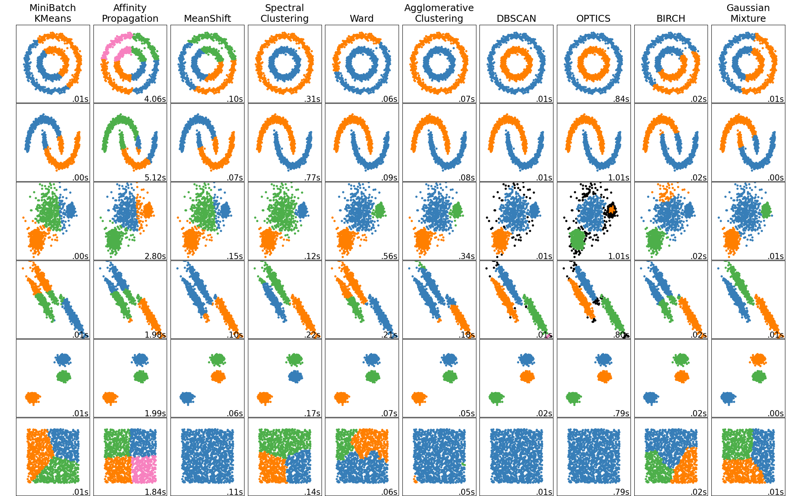
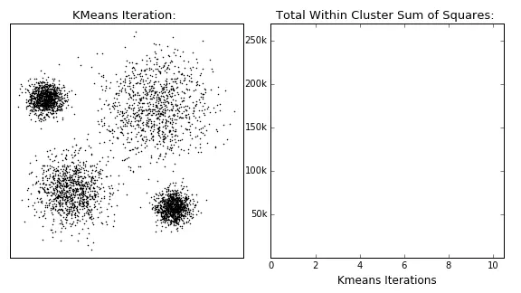
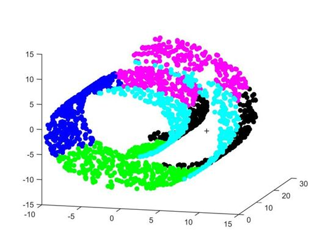
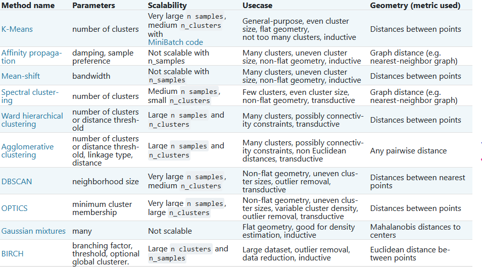

### 1.聚类的概念

对于有标签的数据，我们进行有监督学习，常见的分类任务就是监督学习；而对于无标签的数据，我们希望发现无标签的数据中的潜在信息，这就是无监督学习。聚类，就是无监督学习的一种，它的概念是：将相似的对象归到同一个簇中，使得同一个簇内的数据对象的相似性尽可能大，同时不在同一个簇中的数据对象的差异性也尽可能地大。即聚类后同一类的数据尽可能聚集到一起，不同数据尽量分离。

### 2.聚类算法的分类

聚类算法有很多种分法,常见的分类方法有：

1. 基于划分的聚类：聚类目标是使得类内的点足够近，类间的点足够远，常见的如k-means及其衍生算法
2. 基于密度的聚类：当邻近区域的密度超过某个阈值，则继续聚类，如DBSCAN; OPTICS
3. 层次聚类：包括合并的层次聚类，分裂的层次聚类，实际上可以看作是二叉树的生成和分裂过程。
4. 基于图的聚类： 通过建图来进行聚类，这是聚类算法中的大头，很多较新的聚类算法都有图聚类的思想。

更多的分类可以参考[sklearn文档中关于聚类的划分](https://scikit-learn.org/stable/modules/clustering.html#k-means)

### 3.性能度量
在机器学习中我们都需要对任务进行评价以便于进行下一步的优化，聚类的性能度量主要有一下两种。
* 外部指标：是指把算法得到的划分结果跟某个外部的“参考模型”（如专家给出的划分结果）比较。其实质就是分析分错了和分对了的比例来衡量聚类效果
* 内部指标：是指直接考察聚类结果，不利用任何参考模型的指标。例如轮廓系数：衡量了每个簇中的紧凑度，以及簇间的距离。当每个簇中距离越紧凑，每个簇间距离越远则认为聚类效果优秀。

### 4.距离计算
在机器学习和数据挖掘中，我们经常需要知道个体间差异的大小，进而评价个体的相似性和类别。
* 欧式距离（2-norm距离）:欧氏距离是最易于理解的一种距离计算方法，源自欧氏空间中两点间的距离公式。
$$d(x,y)=\sqrt{\Sigma_{k=1}^n (x_k-y_k)^2}$$
* 曼哈顿距离（Manhattan distance, 1-norm距离）:曼哈顿距离也称为街区距离，是数学中比较常用的距离度量之一，用以表示标准坐标系下两点之间的轴距和。计算公式如下：
$$d(x,y)=\Sigma_{k=1}^n \left|x_k-y_k\right|$$
* 切比雪夫距离：切比雪夫距离和曼哈顿距离类似，但其采用的是两点之间的最大轴距。
  $$d(x,y) = \lim_{n\rightarrow \infty} (\Sigma_{k=1}^n (\left|x_k-y_k\right|)^r)^\dfrac{1}{r} = max_k (\left|x_k-y_k\right|)$$
* 闵可夫斯基距离
  $$d(x,y)=(\Sigma_{k=1}^n (\left|x_k-y_k\right|)^r)^\dfrac{1}{r}$$
  式中，r是一个可变参数，根据参数r取值的不同，闵可夫斯基距离可以表示一类距离  
    r = 1时，为曼哈顿距离  
    r = 2时，为欧式距离  
    r →∞时，为切比雪夫距离  
  闵可夫斯基距离包括欧式距离、曼哈顿距离、切比雪夫距离都假设数据各维属性的量纲和分布（期望、方差）相同，因此适用于度量独立同分布的数据对象。
* 余弦相似性:余弦相似度公式定义如下：
  $$cos⁡(x,y)=\dfrac{xy}{\left|x\right|\left|y\right|} = \dfrac{\Sigma_{k=1}^n x_k y_k}{\sqrt{\Sigma_{k=1}^n x_k^2} \sqrt{\Sigma_{k=1}^n y_k^2}}$$
  余弦相似度实际上是向量x和y夹角的余弦度量，可用来衡量两个向量方向的差异。如果余弦相似度为1，则x和y之间夹角为0°，两向量除模外可认为是相同的；如果预先相似度为0，则x和y之间夹角为90°，则认为两向量完全不同。在计算余弦距离时，将向量均规范化成具有长度11，因此不用考虑两个数据对象的量值。
  余弦相似度常用来度量文本之间的相似性。文档可以用向量表示，向量的每个属性代表一个特定的词或术语在文档中出现的频率，尽管文档具有大量的属性，但每个文档向量都是稀疏的，具有相对较少的非零属性值。
* 马氏距离
  $$mahalanobis(x,y)=(x-y)\Sigma^{-1}(x-y)^T$$
  式中，Σ−1是数据协方差矩阵的逆。
  前面的距离度量方法大都假设样本独立同分布、数据属性之间不相关。马氏距离考虑了数据属性之间的相关性，排除了属性间相关性的干扰，而且与量纲无关。若协方差矩阵是对角阵，则马氏距离变成了标准欧式距离；若协方差矩阵是单位矩阵，各个样本向量之间独立同分布，则变成欧式距离。

  ### 5.K-means
**本次只介绍这一种算法，剩下的大家可以参考前面的sklearn文档实现。**

对于K-Means算法，首先要注意的是k值的选择，一般来说，我们会根据对数据的先验经验选择一个合适的k值，如果没有什么先验知识，则可以通 过交叉验证选择一个合适的k值。在确定了k的个数后，我们需要选择k个初始化的质心。由于我们是启发式方法，k个初始化的质心的位置选择对最后的聚 类结果和运行时间都有很大的影响，因此需要选择合适的k个质心，最好这些质心不能太近。

总结下传统的K-Means算法流程就是：

- 输入是样本隻 $D=\left\{x_{1}, x_{2}, \ldots x_{m}\right\}$, 聚类的笶树 $\mathrm{k}$, 最大迭代次数 $\mathrm{N}$
- 输出是笶划分 $C=\left\{C_{1}, C_{2}, \ldots C_{k}\right\}$
1. 从数据集 $\mathrm{D}$ 中随机选择 $\mathrm{k}$ 个样本作为初始的 $\mathrm{k}$ 个质心向量: $\left\{\mu_{1}, \mu_{2}, \ldots, \mu_{k}\right\}$
2. 对于 $n=1,2, \ldots, \mathrm{N}$
    1. 将簇划分 $\mathrm{C}$ 初始化为 $C_{t}=\varnothing, t=1,2 \ldots k$
    2. 对于 $\mathrm{i}=1,2 \ldots \mathrm{m}$, 计算样本 $x_{i}$ 和各个质心向量 $\mu_{j}(j=1,2, \ldots k)$ 的距离: $d_{i j}=\left\|x_{i}-\mu_{j}\right\|_{2}^{2}$ ， 将 $x_{i}$ 标记最小的为 $d_{i j}$ 所对应的类别 $\lambda_{i}$ 。此时更 新 $C_{\lambda_{i}}=C_{\lambda_{i}} \cup\left\{x_{i}\right\}$
    3. 对于 $\mathrm{j}=1,2, \ldots, \mathrm{k}$, 对 $C_{j}$ 中所有的样本点重新计算新的质心$\mu_{j}=\frac{1}{\left|C_{j}\right|} \sum_{x \in C_{j}} x$
    4. 如果所有的 $k$ 个质心向量都没有发生变化，则转到步骧3
3. 输出笶划分 $C=\left\{C_{1}, C_{2}, \ldots C_{k}\right\}$

**例如下图所示**

下面是使用sklearn的一个简单demo

### 6.K-means的优缺点

- **优点** 
  - 原理比较简单，实现也是很容易，收敛速度快。 
  - 聚类效果较优。 
  - 算法的可解释度比较强。 
  - 主要需要调参的参数仅仅是簇数k。

- **缺点** 
  - K值的选取不好把握 
  - 最终结果和初始点的选择有关，容易陷入局部最优。
  - 对噪音和异常点比较的敏感。
  - 数据必须符合“数据之间的相似度可以使用欧式距离衡量”，这个是什么意思呢，看下图，这种数据的分布，样本点的距离不能简单地用欧式距离来衡量，否则分类效果会非常差。这里的距离衡量应该是“测地距离”，也就是样本沿着曲面到达另一个样本点的距离。如果在这种数据空间想要使用kmeans，必须先进行空间的转化

  

k-means有一些改进算法，多是针对k-means会受异常点的影响这一点来改进的，这里就不详细赘述，只是简单提一下，起一个抛砖引玉的作用。
| 缺点           | 改进      | 描述                                                         |
| -------------- | --------- | ------------------------------------------------------------ |
| k值的确定      | ISODATA   | 当属于某个簇的样本数过少时把这个簇去除， 当属于某个簇的样本数过多、分散程度较大时把这个簇分为两个子簇|
| 对奇异点敏感   | k-median  | 中位数代替平均值作为簇中心                                   |
| 只能找到球状群 | GMM       | 以高斯分布考虑簇内数据点的分布                               |
| 分群结果不稳定 | K-means++ | 初始的聚类中心之间的相互距离要尽可能的远      

详细见：https://scikit-learn.org/stable/modules/clustering.html#overview-of-clustering-methods

### 6、代码实践

- sklearn:[k-means.ipynb](./k-means.ipynb)
- numpy:[k-means.py](k-means.py)

### 8.常见面试题

**8.1 k值的选取**

K-means算法要求事先知道数据集能分为几群，主要有两种方法定义k。

- 手肘法：通过绘制k和损失函数的关系图，选拐点处的k值。

- 经验选取人工据经验先定几个k，多次随机初始化中心选经验上最适合的。

通常都是以经验选取，因为实际操作中拐点不明显，且手肘法效率不高。

**8.2 为什么在计算K-means之前要将数据点在各维度上归一化**

因为数据点各维度的量级不同。
举个例子，最近正好做完基于RFM模型的会员分群，每个会员分别有R（最近一次购买距今的时长）、F（来店消费的频率）和M（购买金额）。如果这是一家奢侈品商店，你会发现M的量级（可能几万元）远大于F（可能平均10次以下），如果不归一化就算K-means，相当于F这个特征完全无效。如果我希望能把常客与其他顾客区别开来，不归一化就做不到。

**8.3 K-means不适用哪些数据**

1. 数据特征极强相关的数据集，因为会很难收敛（损失函数是非凸函数），一般要用kernal K-means，将数据点映射到更高维度再分群。
2. 数据集可分出来的簇密度不一，或有很多离群值（outliers），这时候考虑使用密度聚类。

**8.4 K-means中空聚类的处理**

如果所有的点在指派步骤都未分配到某个簇，就会得到空簇。如果这种情况发生，则需要某种策略来选择一个替补质心，否则的话，平方误差将会偏大。一种方法是选择一个距离当前任何质心最远的点。这将消除当前对总平方误差影响最大的点。另一种方法是从具有最大SEE的簇中选择一个替补的质心。这将分裂簇并降低聚类的总SEE。如果有多个空簇，则该过程重复多次。另外编程实现时，要注意空簇可能导致的程序bug。

**参考文献**
- 西瓜书
- 统计学习方法
- 维基百科
- https://www.zybuluo.com/rianusr/note/1199877
- https://blog.csdn.net/zhouxianen1987/article/details/68945844
- http://ddrv.cn/a/66611
- https://zhuanlan.zhihu.com/p/29538307
- https://github.com/Eajack/Statical-Learning-Method-LiHang_py_Eajack
- https://github.com/datawhalechina/daily-interview
- https://segmentfault.com/a/1190000041528708