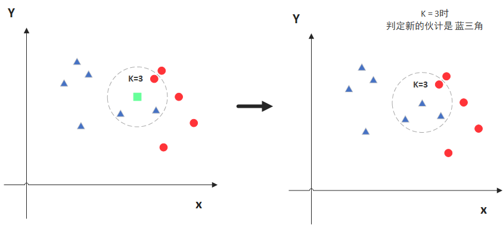
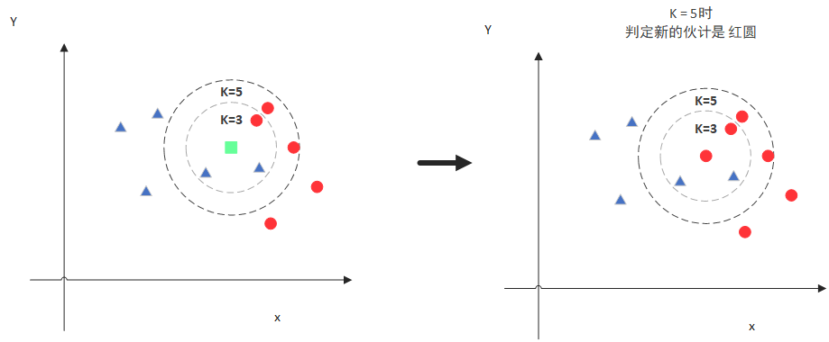
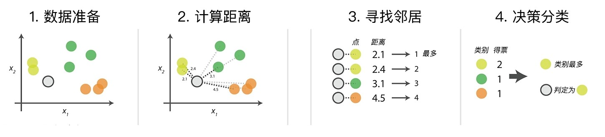

### 1.KNN算法简介

KNN的全称是K Nearest Neighbors，意思是K个最近的邻居，可以用于分类和回归，是一种监督学习算法。它的思路是这样，如果一个样本在特征空间中的K个最相似(即特征空间中最邻近)的样本中的大多数属于某一个类别，则该样本也属于这个类别。也就是说，该方法在定类决策上只依据最邻近的一个或者几个样本的类别来决定待分样本所属的类别。

以下图为例

图中绿色的点就是我们要预测的那个点，假设K=3。那么KNN算法就会找到与它距离最近的三个点（这里用圆圈把它圈起来了），看看哪种类别多一些，比如这个例子中是蓝色三角形多一些，新来的绿色点就归类到蓝三角了。

但是，当K=5的时候，判定就变成不一样了。这次变成红圆多一些，所以新来的绿点被归类成红圆。从这个例子中，我们就能看得出K的取值是很重要的。

### 2.KNN算法介绍

#### 2.1 KNN算法三要素

**2.1.1 关于距离的衡量方法**：具体介绍参见K-means介绍

KNN算法中要求数据的所有特征都可以做量化，若在数据特征中存在非数值类型,必须采用手段将其量化为数值。

在sklearn中，KNN分类器提供了四种距离
- 欧式距离(euclidean) - 默认
- 曼哈顿距离(manhatten)
- 切比雪夫距离(chebyshev) 
- 闵可夫斯基距离(minkowski) 

**2.1.2 K值的选择问题** 

在KNN分类中，K值的选择往往没有一个固定的经验，可以通过不停调整(例如交叉验证)到一个合适的K值。
1. K为1。如果K值被设定为1，那么训练集的正确率将达到100%(将训练集同时作为预测集)，因为每个点只会找到它本身，但同时在预测集中的正确率不会太高（极度过拟合）。
2. K为较小的值。较小的邻域往往会带来更低的训练误差，但会导致过拟合的问题降低预测集的准确率。
3. K为较大的值。较大的邻域会增大训练误差，但能够有效减少过拟合的问题。（注意，这并不意味着预测集的准确率一定会增加）
4. K为训练集样本数量。当K极端到邻域覆盖整个样本时，就相当于不再分类而直接选择在训练集中出现最多的类。

在实际应用中，K 值一般选择一个较小的数值，通常采用交叉验证的方法来选择最优的 K 值。随着训练实例数目趋向于无穷和 K=1 时，误差率不会超过贝叶斯误差率的2倍，如果K也趋向于无穷，则误差率趋向于贝叶斯误差率。（贝叶斯误差可以理解为最小误差）

三种交叉验证方法：
- Hold-Out： 随机从最初的样本中选出部分，形成交叉验证数据，而剩余的就当做训练数据。 一般来说，少于原本样本三分之一的数据被选做验证数据。常识来说，Holdout 验证并非一种交叉验证，因为数据并没有交叉使用。
- K-foldcross-validation：K折交叉验证，初始采样分割成K个子样本，一个单独的子样本被保留作为验证模型的数据，其他K-1个样本用来训练。交叉验证重复K次，每个子样本验证一次，平均K次的结果或者使用其它结合方式，最终得到一个单一估测。这个方法的优势在于，同时重复运用随机产生的子样本进行训练和验证，每次的结果验证一次，10折交叉验证是最常用的。
- Leave-One-Out Cross Validation：正如名称所建议， 留一验证(LOOCV)意指只使用原本样本中的一项来当做验证资料， 而剩余的则留下来当做训练资料。 这个步骤一直持续到每个样本都被当做一次验证资料。 事实上，这等同于 K-fold 交叉验证是一样的，其中K为原本样本个数。

**2.1.3 分类决策的准则**

明确K个邻居中所有数据类别的个数，将测试数据划分给个数最多的那一类。即由输入实例的 K 个最临近的训练实例中的多数类决定输入实例的类别。
最常用的两种决策规则：
- 多数表决法：多数表决法和我们日常生活中的投票表决是一样的，少数服从多数，是最常用的一种方法。
- 加权表决法：有些情况下会使用到加权表决法，比如投票的时候裁判投票的权重更大，而一般人的权重较小。所以在数据之间有权重的情况下，一般采用加权表决法。

多数表决法图示说明（其中K=4）：

#### 2.2 KNN算法的步骤

输入: 训练数据集 $T=\left\{\left(\mathrm{x}_{1}, \mathrm{y}_{1}\right),\left(\mathrm{x}_{2}, \mathrm{y}_{2}\right) \ldots . . .\left(\mathrm{x}_{\mathrm{N}}, \mathrm{y}_{\mathrm{N}}\right)\right\}, \mathrm{x}_{1}$ 为实例的特征向量, $\mathrm{yi}=\left\{\mathrm{c}_{1}, \mathrm{c}_{2}, \ldots \mathrm{c}_{k}\right\}$ 为实剅类别。

输出: 实例 $\mathrm{x}$ 所属的类别 $\mathrm{y}$ 。

**步骤：**
1. 选择参数 $K$
2. 计算末知实例与所有已知实例的距离 (可选择多种计算距离的方式)
3. 选择最近 $K$ 个已知实例
4. 根据少数服从多数的投眎法则(majority-voting), 让末知实例归类为 $\mathrm{K}$ 个最邻近样本中最多数的类别。加权表决法同理。

#### 2.3 KNN算法的优缺点

**优点**
- KNN是一种较为成熟的算法，同时思路也比较简单，能够同时兼容回归与分类（KNN的回归将在日后的回归算法中提到）。
- KNN时间复杂度为O(n)。因为是懒惰学习，在训练阶段速度比较快。
- 可以用于非线性分类。
- 未对数据进行任何假设，因此对异常点不敏感。
- 通过近邻而不是通过类域判别，对类域交叉重叠“较多的样本具有较好的预测效果。

**缺点**
- 在特征较多的情况下，会有很大的计算量。
- 需要存储所有的训练数据，对内存要求高。
- 因为是懒惰学习（在测试样本阶段学习），预测阶段速度比较慢。
- 在样本不平衡时，容易造成误判。
- 对数据规模敏感。在大的训练集中有较高正确率，当规模小的时候正确率低。

### 3.算法实践

- sklearn:[knn.ipynb](./knn.ipynb)
- numpy:[knn.py](./knn.py)

### 4.常见面试题

#### 4.1 为了解决KNN算法计算量过大的问题，可以使用分组的方式进行计算，简述一下该方式的原理。

先将样本按距离分解成组，获得质心，然后计算未知样本到各质心的距离，选出距离最近的一组或几组，再在这些组内引用KNN。     
本质上就是事先对已知样本点进行剪辑，事先去除对分类作用不大的样本，该方法比较适用于样本容量比较大时的情况。

#### 4.2 K-Means与KNN有什么区别
- KNN
	+ KNN是分类算法 
	+ 监督学习 
	+ 喂给它的数据集是带label的数据，已经是完全正确的数据
	+ 没有明显的前期训练过程，属于memory-based learning	
	+ K的含义：来了一个样本x，要给它分类，即求出它的y，就从数据集中，在x附近找离它最近的K个数据点，这K个数据点，类别c占的个数最多，就把x的label设为c

- K-Means
	+ 1.K-Means是聚类算法 
	+ 2.非监督学习 
	+ 3.喂给它的数据集是无label的数据，是杂乱无章的，经过聚类后才变得有点顺序，先无序，后有序
	+ 有明显的前期训练过程
	+ K的含义：K是人工固定好的数字，假设数据集合可以分为K个簇，由于是依靠人工定好，需要一点先验知识

- 相似点
	- 都包含这样的过程，给定一个点，在数据集中找离它最近的点。即二者都用到了NN(Nears Neighbor)算法，一般用KD树来实现NN。

#### 4.3 讲解一下用于计算邻居的算法

- KD 树
  - 参考：https://scikit-learn.org/stable/modules/generated/sklearn.neighbors.KDTree.html
- 球树
  - 参考：https://scikit-learn.org/stable/modules/generated/sklearn.neighbors.BallTree.html

**参考文献**
- 西瓜书
- 统计学习方法
- 维基百科
- https://www.cnblogs.com/listenfwind/p/10311496.html
- https://blog.csdn.net/weixin_43179522/article/details/105665528
- https://jiang-hs.github.io/post/dIjHdNcg_/
- https://codeshellme.github.io/2020/11/ml-knn2/
- https://github.com/datawhalechina/daily-interview/blob/8b29d467997c9ccad1d4796bace87444b4c8c751/AI%E7%AE%97%E6%B3%95/machine-learning/kNN.md
- https://github.com/fengdu78/lihang-code/blob/master/%E7%AC%AC03%E7%AB%A0%20k%E8%BF%91%E9%82%BB%E6%B3%95/3.KNearestNeighbors.ipynb