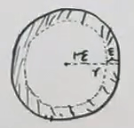
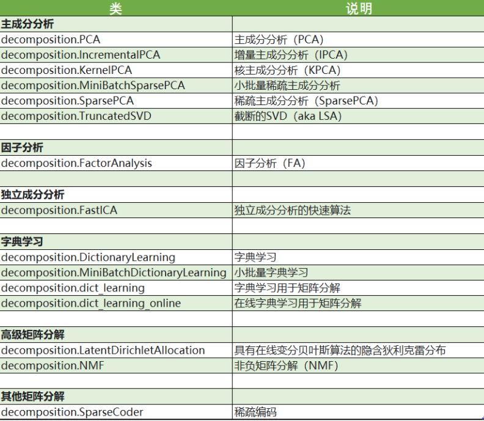
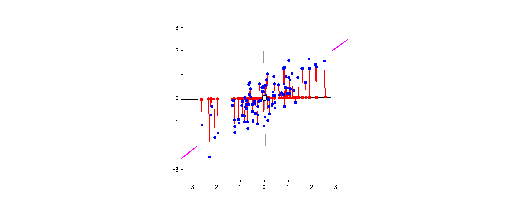

### 1.降维的基本介绍

机器学习领域中所谓的降维就是指采用某种映射方法，将原高维空间中的数据点映射到低维度的空间中。降维的本质是学习一个映射函数 f : x->y，其中x是原始数据点的表达，目前最多使用向量表达形式。 y是数据点映射后的低维向量表达，通常y的维度小于x的维度（当然提高维度也是可以的）。f可能是显式的或隐式的、线性的或非线性的。

关于维度灾难的一个理解角度：

假设存在下面这样一个球，D维，其半径为r=1，里面圆环的长度为$\varepsilon$

则我们可以计算得知

$$
\begin{aligned}
&V_{\text {外 }}=K \cdot 1^{D}=K\\
&V_{\text {环 }}=V_{\text {外 }}-V_{\text {内 }}\\
&=k-k \cdot(1-\varepsilon)^{D}\\
&\frac{V_{环}}{V_{外}}=\frac{k-k(1-\varepsilon)^{D}}{k}={1-(1-\varepsilon)^{D}}
\end{aligned}
$$

$K$为一个常数，由于0<$\varepsilon$<1，因此$\lim _{D^{\rightarrow \infty}}(1-\varepsilon)^{D}=0$，则$\lim _{D \rightarrow \infty} \frac{V_{环}}{V_{外}}=1$。这就是所谓的维度灾难，在高维数据中，主要样本都分布在立方体的边缘，所以数据集更加稀疏。

那从另外一个角度来看：为什么dimension reduction可能是有用的，如上图所示，假设你的data分布是这样的(在3D里面像螺旋的样子)，但是用3D空间来描述这些data其实是很浪费的，其实你从资源就可以说：你把这个类似地毯卷起来的东西把它摊开就变成这样(右边的图)。所以你只需要在2D的空间就可以描述这个3D的information，你根本不需要把这个问题放到这个3D来解，这是把问题复杂化，其实你可以在2D就可以做这个task

#### 1.1常见降维算法比较

**降维的算法分为：**

1.  直接降维，特征选择
2.  线性降维，PCA，MDS等
3.  分线性，流形包括 Isomap，LLE 等

#### 1.2sklearn中的降维算法

**本章节主要介绍一下PCA**

### 2. 主成分分析PCA

视频讲解参考：
- [李宏毅老师视频](https://www.bilibili.com/video/BV1Ht411g7Ef?p=24)：https://www.bilibili.com/video/BV1Ht411g7Ef?p=24
- [白板机器学习](https://www.bilibili.com/video/BV1aE411o7qd?p=22)：https://www.bilibili.com/video/BV1aE411o7qd?p=22

#### 2.1损失函数

我们假设数据集为
$$
X_{N\times p}=(x_{1},x_{2},\cdots,x_{N})^{T},x_{i}=(x_{i1},x_{i2},\cdots,x_{ip})^{T}
$$
 这个记号表示有 $N$ 个样本，每个样本都是 $p$ 维向量。其中每个观测都是由 $p(x|\theta)$ 生成的。

为了方便，我们首先将协方差矩阵（数据集）写成中心化的形式：
$$
\begin{aligned}
S &=\frac{1}{N} \sum_{i=1}^{N}\left(x_{i}-\bar{x}\right)\left(x_{i}-\bar{x}\right)^{T} \\
&=\frac{1}{N}\left(x_{1}-\bar{x}, x_{2}-\bar{x}, \cdots, x_{N}-\bar{x}\right)\left(x_{1}-\bar{x}, x_{2}-\bar{x}, \cdots, x_{N}-\bar{x}\right)^{T} \\
&=\frac{1}{N}\left(X^{T}-\frac{1}{N} X^{T} \mathbb{I}_{N 1} \mathbb{I}_{N 1}^{T}\right)\left(X^{T}-\frac{1}{N} X^{T} \mathbb{I}_{N 1} \mathbb{I}_{N 1}^{T}\right)^{T} \\
&=\frac{1}{N} X^{T}\left(E_{N}-\frac{1}{N} \mathbb{I}_{N 1} \mathbb{I}_{1 N}\right)\left(E_{N}-\frac{1}{N} \mathbb{I}_{N 1} \mathbb{I}_{1 N}\right)^{T} X \\
&=\frac{1}{N} X^{T} H_{N} H_{N}^{T} X \\
&=\frac{1}{N} X^{T} H_{N} H_{N} X=\frac{1}{N} X^{T} H X
\end{aligned}
$$
这个式子利用了中心矩阵 $ H$的对称性，这也是一个投影矩阵。

主成分分析中，我们的基本想法是将所有数据投影到一个字空间中，从而达到降维的目标，为了寻找这个子空间，我们基本想法是：

1.  所有数据在子空间中更为分散
2.  损失的信息最小，即：在补空间的分量少

原来的数据很有可能各个维度之间是相关的，于是我们希望找到一组 $p$ 个新的线性无关的单位基 $u_i$，降维就是取其中的 $q$ 个基。于是对于一个样本 $x_i$，经过这个坐标变换后：
$$
\hat{x_i}=\sum\limits_{i=1}^p(u_i^Tx_i)u_i=\sum\limits_{i=1}^q(u_i^Tx_i)u_i+\sum\limits_{i=q+1}^p(u_i^Tx_i)u_i
$$
对于数据集来说，我们首先将其中心化然后再去上面的式子的第一项，并使用其系数的平方平均作为损失函数并最大化：
$$
\begin{aligned}
J &=\frac{1}{N} \sum_{i=1}^{N} \sum_{j=1}^{q}\left(\left(x_{i}-\bar{x}\right)^{T} u_{j}\right)^{2} \\
&=\sum_{j=1}^{q} u_{j}^{T} S u_{j}, \text { s.t. } u_{j}^{T} u_{j}=1
\end{aligned}
$$
由于每个基都是线性无关的，于是每一个 $u_j$ 的求解可以分别进行，使用拉格朗日乘子法：
$$
\mathop{argmax}_{u_j}L(u_j,\lambda)=\mathop{argmax}_{u_j}u_j^TSu_j+\lambda(1-u_j^Tu_j)
$$
于是：
$$
Su_j=\lambda u_j
$$
可见，我们需要的基就是协方差矩阵的本征矢。损失函数最大取在本征值前 $q$ 个最大值。

下面看其损失的信息最少这个条件，同样适用系数的平方平均作为损失函数，并最小化：
$$
\begin{aligned}
J &=\frac{1}{N} \sum_{i=1}^{N} \sum_{j=q+1}^{p}\left(\left(x_{i}-\bar{x}\right)^{T} u_{j}\right)^{2} \\
&=\sum_{j=q+1}^{p} u_{j}^{T} S u_{j}, \text { s.t. } u_{j}^{T} u_{j}=1
\end{aligned}
$$
同样的：
$$
\mathop{argmin}_{u_j}L(u_j,\lambda)=\mathop{argmin}_{u_j}u_j^TSu_j+\lambda(1-u_j^Tu_j)
$$
损失函数最小取在本征值剩下的个最小的几个值。数据集的协方差矩阵可以写成 $S=U\Lambda U^T$，直接对这个表达式当然可以得到本征矢。

#### 2.2SVD 与 PCoA

下面使用实际训练时常常使用的 SVD 直接求得这个 $q$ 个本征矢。

对中心化后的数据集进行奇异值分解：
$$
HX=U\Sigma V^T,U^TU=E_N,V^TV=E_p,\Sigma:N\times p
$$

于是：
$$
S=\frac{1}{N}X^THX=\frac{1}{N}X^TH^THX=\frac{1}{N}V\Sigma^T\Sigma V^T
$$
因此，我们直接对中心化后的数据集进行 SVD，就可以得到特征值和特征向量 $V$，在新坐标系中的坐标就是：
$$
HX\cdot V 
$$
由上面的推导，我们也可以得到另一种方法 PCoA 主坐标分析，定义并进行特征值分解：
$$
T=HXX^TH=U\Sigma\Sigma^TU^T
$$
由于：
$$
TU\Sigma=U\Sigma(\Sigma^T\Sigma)
$$
于是可以直接得到坐标。这两种方法都可以得到主成分，但是由于方差矩阵是 $p\times p$ 的，而 $T$ 是 $N\times N$ 的，所以对样本量较少的时候可以采用 PCoA的方法。

**总结来说就是**

输入: 样本集 $D=\left\{\boldsymbol{x}_{1}, \boldsymbol{x}_{2}, \ldots, \boldsymbol{x}_{m}\right\}$;
低维空间维数 $d^{\prime}$.

过程:

1. 对所有样本进行中心化: $\boldsymbol{x}_{i} \leftarrow \boldsymbol{x}_{i}-\frac{1}{m} \sum_{i=1}^{m} \boldsymbol{x}_{i}$;
2. 计算样本的协方差矩阵 $\mathbf{X X} \mathbf{X}^{\mathrm{T}}$;
3. 对协方差矩阵 XXX
4. 取最大的 $d^{\prime}$ 个特征值所对应的特征向量 $\boldsymbol{w}_{1}, \boldsymbol{w}_{2}, \ldots, \boldsymbol{w}_{d^{\prime}}$.
5. 
输出: 投影矩阵 $\mathbf{W}=\left(\boldsymbol{w}_{1}, \boldsymbol{w}_{2}, \ldots, \boldsymbol{w}_{d^{\prime}}\right)$.

#### 2.3p-PCA

下面从概率的角度对 PCA 进行分析，概率方法也叫 p-PCA。我们使用线性模型，类似之前 LDA，我们选定一个方向，对原数据 $x\in\mathbb{R}^p$ ，降维后的数据为 $z\in\mathbb{R}^q,q<p$。降维通过一个矩阵变换（投影）进行：
$$
\begin{aligned}
&z \sim \mathcal{N}\left(\mathbb{O}_{q 1}, \mathbb{I}_{q q}\right) \\
&x=W z+\mu+\varepsilon \\
&\varepsilon \sim \mathcal{N}\left(0, \sigma^{2} \mathbb{I}_{p p}\right)
\end{aligned}
$$
对于这个模型，我么可以使用期望-最大（EM）的算法进行学习，在进行推断的时候需要求得 $p(z|x)$，推断的求解过程和线性高斯模型类似。
$$
\begin{gathered}
p(z \mid x)=\frac{p(x \mid z) p(z)}{p(x)} \\
\mathbb{E}[x]=\mathbb{E}[W z+\mu+\varepsilon]=\mu \\
\operatorname{Var}[x]=W W^{T}+\sigma^{2} \mathbb{I}_{p p} \\
\Longrightarrow p(z \mid x)=\mathcal{N}\left(W^{T}\left(W W^{T}+\sigma^{2} \mathbb{I}\right)^{-1}(x-\mu), \mathbb{I}-W^{T}\left(W W^{T}+\sigma^{2} \mathbb{I}\right)^{-1} W\right)
\end{gathered}
$$

### 3.代码实践

- sklearn:[PCA.ipynb](./PCA.ipynb)
- numpy:[PCA.py](./PCA.py)

### 4.常见面试题

**参考文献**
- 西瓜书
- 统计学习方法
- 维基百科
- 李宏毅老师机器学习
- https://chenrudan.github.io/blog/2016/04/01/dimensionalityreduction.html#1
- 白板机器学习
- https://wang520yan.github.io/2020/05/12/%E4%B8%BB%E6%88%90%E5%88%86%E5%88%86%E6%9E%90PCA/
- https://www.zybuluo.com/JeemyJohn/note/990690
- https://www.yuque.com/books/share/f4031f65-70c1-4909-ba01-c47c31398466/kg2npf