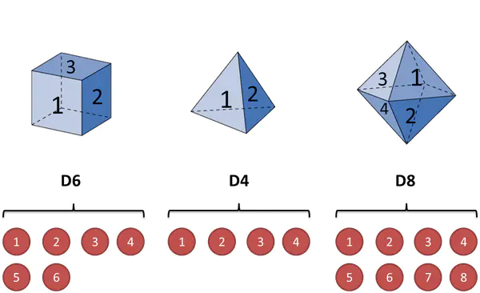
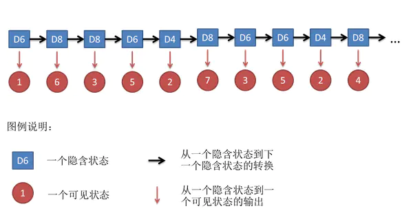
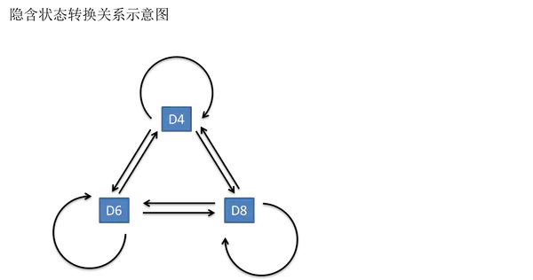

### 1. 隐马尔可夫模型概述

隐马尔可夫模型是一种概率图模型。我们知道，机器学习模型可以从频率派和贝叶斯派两个方向考虑，在频率派的方法中的核心是优化问题，而在贝叶斯派的方法中，核心是积分问题，也发展出来了一系列的积分方法如变分推断，MCMC 等。概率图模型最基本的模型可以分为有向图（贝叶斯网络）和无向图（马尔可夫随机场）两个方面，例如 GMM，在这些基本的模型上，如果样本之间存在关联，可以认为样本中附带了时序信息，从而样本之间不独立全同分布的，这种模型就叫做动态模型，隐变量随着时间发生变化，于是观测变量也发生变化：

根据状态变量的特点，可以分为：

1. HMM，状态变量（隐变量）是离散的
2. Kalman 滤波，状态变量是连续的，线性的
3. 粒子滤波，状态变量是连续，非线性的

### 2. 隐马尔可夫模型例子

这个例子来自于网上，我们使用这个例子来引出一些基本概念。首先假设我手里有三个不同的骰子：
- 第一个骰子是我们平常见的骰子（称这个骰子为D6），6个面，每个面（1，2，3，4，5，6）出现的概率是1/6。
- 第二个骰子是个四面体（称这个骰子为D4），每个面（1，2，3，4）出现的概率是1/4。
- 第三个骰子有八个面（称这个骰子为D8），每个面（1，2，3，4，5，6，7，8）出现的概率是1/8。

现在开始掷骰子：
- 挑骰子：从三个骰子里挑一个（挑到每一个骰子的概率都是1/3）
- 掷骰子：将得到一个数字（1，2，3，4，5，6，7，8中的一个）

不停的重复上述过程，我们会得到一串数字，例如我们可能得到这么一串数字（掷骰子10次）：`1 6 3 5 2 7 3 5 2 4`,我们称这串数字叫做可见状态链。

在隐马尔可夫模型中，不仅仅有这么一串可见状态链，还有一串隐含状态链。在这个例子里，这串隐含状态链就是你用的骰子的序列。比如，隐含状态链有可能是：`D6 D8 D8 D6 D4 D8 D6 D6 D4 D8`

一般来说，HMM中说到的马尔可夫链其实是指隐含状态链，因为隐含状态（骰子）之间存在转换概率（transition probability）。

在这个例子里，D6的下一个状态是D4，D6，D8的概率都是1/3。D4，D8的下一个状态是D4，D6，D8的转换概率也都一样是1/3。我们其实可以随意设定转换概率的。比如，我们可以这样定义：D6后面不能接D4，D6后面是D6的概率是0.9，是D8的概率是0.1。这样就是一个新的HMM。

同样的，尽管可见状态之间没有转换概率，但是隐含状态和可见状态之间有一个概率叫做输出概率（emission probability）。就我们的例子来说，六面骰（D6）产生1的输出概率是1/6。产生2，3，4，5，6的概率也都是1/6。我们同样可以对输出概率进行其他定义。比如，我有一个被赌场动过手脚的六面骰子，掷出来是1的概率更大，是1/2，掷出来是2，3，4，5，6的概率是1/10。

其实对于HMM来说，如果提前知道所有隐含状态之间的转换概率和所有隐含状态到所有可见状态之间的输出概率，做模拟是相当容易的。但在实际运用中，往往会缺失一部分信息：有时候你知道骰子有几种，每种骰子是什么，但是不知道掷出来的骰子序列；有时候你知道骰子序列，剩下的什么都不知道。

### 3.HMM讲解

这部分主要来自[白板机器学习](https://www.bilibili.com/video/BV1aE411o7qd?p=82):https://www.bilibili.com/video/BV1aE411o7qd?p=82

通过上面例子我们已经有了一个较为形象化的理解，HMM用概率图表示为

上图表示了四个时刻的隐变量变化。用参数 $\lambda=(\pi,A,B)$ 来表示，其中 $\pi$ 是开始的概率分布，$A$ 为状态转移矩阵，$B$ 为发射矩阵。

下面使用 $ o_t$ 来表示观测变量，$O$ 为观测序列，$V=\{v_1,v_2,\cdots,v_M\}$ 表示观测的值域，$i_t$ 表示状态变量，$I$ 为状态序列，$Q=\{q_1,q_2,\cdots,q_N\}$ 表示状态变量的值域。定义 $A=(a_{ij}=p(i_{t+1}=q_j|i_t=q_i))$ 表示状态转移矩阵，$B=(b_j(k)=p(o_t=v_k|i_t=q_j))$ 表示发射矩阵。

在 HMM 中，有两个基本假设：

1.  齐次 Markov 假设（未来只依赖于当前）：
    $$
    p(i_{t+1}|i_t,i_{t-1},\cdots,i_1,o_t,o_{t-1},\cdots,o_1)=p(i_{t+1}|i_t)
    $$
    
2.  观测独立假设：
    $$
    p(o_t|i_t,i_{t-1},\cdots,i_1,o_{t-1},\cdots,o_1)=p(o_t|i_t)
    $$
    

HMM 要解决三个问题：

1.  Evaluation：$p(O|\lambda)$，Forward-Backward 算法
2.  Learning：$\lambda=\mathop{argmax}\limits_{\lambda}p(O|\lambda)$，EM 算法（Baum-Welch）
3.  Decoding：$I=\mathop{argmax}\limits_{I}p(I|O,\lambda)$，Vierbi 算法
    1.  预测问题：$p(i_{t+1}|o_1,o_2,\cdots,o_t)$
    2.  滤波问题：$p(i_t|o_1,o_2,\cdots,o_t)$

#### 3.1Evaluation

$$
p(O|\lambda)=\sum\limits_{I}p(I,O|\lambda)=\sum\limits_{I}p(O|I,\lambda)p(I|\lambda)
$$

$$
p(I|\lambda)=p(i_1,i_2,\cdots,i_t|\lambda)=p(i_t|i_1,i_2,\cdots,i_{t-1},\lambda)p(i_1,i_2,\cdots,i_{t-1}|\lambda)
$$

根据齐次 Markov 假设：
$$
p(i_t|i_1,i_2,\cdots,i_{t-1},\lambda)=p(i_t|i_{t-1})=a_{i_{t-1}i_t}
$$
所以：
$$
p(I|\lambda)=\pi_1\prod\limits_{t=2}^Ta_{i_{t-1},i_t}
$$
又由于：
$$
p(O|I,\lambda)=\prod\limits_{t=1}^Tb_{i_t}(o_t)
$$
于是：
$$
p(O|\lambda)=\sum\limits_{I}\pi_{i_1}\prod\limits_{t=2}^Ta_{i_{t-1},i_t}\prod\limits_{t=1}^Tb_{i_t}(o_t)
$$
我们看到，上面的式子中的求和符号是对所有的观测变量求和，于是复杂度为 $O(N^T)$。

下面，记 $\alpha_t(i)=p(o_1,o_2,\cdots,o_t,i_t=q_i|\lambda)$，所以，$\alpha_T(i)=p(O,i_T=q_i|\lambda)$。我们看到：
$$
p(O|\lambda)=\sum\limits_{i=1}^Np(O,i_T=q_i|\lambda)=\sum\limits_{i=1}^N\alpha_T(i)
$$

对 $\alpha_{t+1}(j)$：

$$
\begin{aligned}
\alpha_{t+1}(j) &=p\left(o_{1}, o_{2}, \cdots, o_{t+1}, i_{t+1}=q_{j} \mid \lambda\right) \\
&=\sum_{i=1}^{N} p\left(o_{1}, o_{2}, \cdots, o_{t+1}, i_{t+1}=q_{j}, i_{t}=q_{i} \mid \lambda\right) \\
&=\sum_{i=1}^{N} p\left(o_{t+1}\left|o_{1}, o_{2}, \cdots, i_{t+1}=q_{j}, i_{t}=q_{i}\right| \lambda\right) p\left(o_{1}, \cdots, o_{t}, i_{t}=q_{i}, i_{t+1}=q_{j} \mid \lambda\right)
\end{aligned}
$$
利用观测独立假设：
$$
\begin{aligned}
\alpha_{t+1}(j) &=\sum_{i=1}^{N} p\left(o_{t+1} \mid i_{t+1}=q_{j}\right) p\left(o_{1}, \cdots, o_{t}, i_{t}=q_{i}, i_{t+1}=q_{j} \mid \lambda\right) \\
&=\sum_{i=1}^{N} p\left(o_{t+1} \mid i_{t+1}=q_{j}\right) p\left(i_{t+1}=q_{j} \mid o_{1}, \cdots, o_{t}, i_{t}=q_{i}, \lambda\right) p\left(o_{1}, \cdots, o_{t}, i_{t}=q_{i} \mid \lambda\right) \\
&=\sum_{i=1}^{N} b_{j}\left(o_{t}\right) a_{i j} \alpha_{t}(i)
\end{aligned}
$$
上面利用了齐次 Markov 假设得到了一个递推公式，这个算法叫做前向算法。

还有一种算法叫做后向算法，定义 $\beta_t(i)=p(o_{t+1},o_{t+1},\cdots，o_T|i_t=i,\lambda)$：
$$
\begin{aligned}
p(O \mid \lambda) &=p\left(o_{1}, \cdots, o_{T} \mid \lambda\right) \\
&=\sum_{i-1}^{N} p\left(o_{1}, o_{2}, \cdots, o_{T}, i_{1}=q_{i} \mid \lambda\right) \\
&=\sum_{i=1}^{N} p\left(o_{1}, o_{2}, \cdots, o_{T} \mid i_{1}=q_{i}, \lambda\right) \pi_{i} \\
&=\sum_{i=1}^{N} p\left(o_{1} \mid o_{2}, \cdots, o_{T}, i_{1}=q_{i}, \lambda\right) p\left(o_{2}, \cdots, o_{T} \mid i_{1}=q_{i}, \lambda\right) \pi_{i} \\
&=\sum_{i=1}^{N} b_{i}\left(o_{1}\right) \pi_{i} \beta_{1}(i)
\end{aligned}
$$
对于这个 $\beta_1(i)$：
$$
\begin{aligned}
\beta_{t}(i) &=p\left(o_{t+1}, \cdots, o_{T} \mid i_{t}=q_{i}\right) \\
&=\sum_{j=1}^{N} p\left(o_{t+1}, o_{t+2}, \cdots, o_{T}, i_{t+1}=q_{j} \mid i_{t}=q_{i}\right) \\
&=\sum_{j=1}^{N} p\left(o_{t+1}, \cdots, o_{T} \mid i_{t+1}=q_{j}, i_{t}=q_{i}\right) p\left(i_{t+1}=q_{j} \mid i_{t}=q_{i}\right) \\
&=\sum_{j=1}^{N} p\left(o_{t+1}, \cdots, o_{T} \mid i_{t+1}=q_{j}\right) a_{i j} \\
&=\sum_{j=1}^{N} p\left(o_{t+1} \mid o_{t+2}, \cdots, o_{T}, i_{t+1}=q_{j}\right) p\left(o_{t+2}, \cdots, o_{T} \mid i_{t+1}=q_{j}\right) a_{i j} \\
&=\sum_{j=1}^{N} b_{j}\left(o_{t+1}\right) a_{i j} \beta_{t+1}(j)
\end{aligned}
$$
于是后向地得到了第一项。

#### 3.2Learning

为了学习得到参数的最优值，在 MLE 中：
$$
\lambda_{MLE}=\mathop{argmax}_\lambda p(O|\lambda)
$$
我们采用 EM 算法（在这里也叫 Baum Welch 算法），用上标表示迭代：
$$
\theta^{t+1}=\mathop{argmax}_{\theta}\int_z\log p(X,Z|\theta)p(Z|X,\theta^t)dz
$$
其中，$X$ 是观测变量，$Z$ 是隐变量序列。于是：
$$
\lambda^{t+1}=\mathop{argmax}_\lambda\sum\limits_I\log p(O,I|\lambda)p(I|O,\lambda^t)\\
=\mathop{argmax}_\lambda\sum\limits_I\log p(O,I|\lambda)p(O,I|\lambda^t)
$$
 这里利用了 $p(O|\lambda^t)$ 和$\lambda$ 无关。将 Evaluation 中的式子代入：
$$
\sum\limits_I\log p(O,I|\lambda)p(O,I|\lambda^t)=\sum\limits_I[\log \pi_{i_1}+\sum\limits_{t=2}^T\log a_{i_{t-1},i_t}+\sum\limits_{t=1}^T\log b_{i_t}(o_t)]p(O,I|\lambda^t)
$$
对 $\pi^{t+1}$：
$$
\begin{aligned}
\pi^{t+1} &=\operatorname{argmax}_{\pi} \sum_{I}\left[\log \pi_{i_{1}} p\left(O, I \mid \lambda^{t}\right)\right] \\
&=\operatorname{argmax}_{\pi} \sum_{I}\left[\log \pi_{i_{1}} \cdot p\left(O, i_{1}, i_{2}, \cdots, i_{T} \mid \lambda^{t}\right)\right]
\end{aligned}
$$
上面的式子中，对 $i_2,i_2,\cdots,i_T$ 求和可以将这些参数消掉：
$$
\pi^{t+1}=\mathop{argmax}_\pi\sum\limits_{i_1}[\log \pi_{i_1}\cdot p(O,i_1|\lambda^t)]
$$
上面的式子还有对 $\pi$ 的约束 $\sum\limits_i\pi_i=1$。定义 Lagrange 函数：
$$
L(\pi,\eta)=\sum\limits_{i=1}^N\log \pi_i\cdot p(O,i_1=q_i|\lambda^t)+\eta(\sum\limits_{i=1}^N\pi_i-1)
$$
于是：
$$
\frac{\partial L}{\partial\pi_i}=\frac{1}{\pi_i}p(O,i_1=q_i|\lambda^t)+\eta=0
$$
对上式求和：
$$
\sum\limits_{i=1}^Np(O,i_1=q_i|\lambda^t)+\pi_i\eta=0\Rightarrow\eta=-p(O|\lambda^t)
$$
所以：
$$
\pi_i^{t+1}=\frac{p(O,i_1=q_i|\lambda^t)}{p(O|\lambda^t)}
$$

#### 3.3Decoding

Decoding 问题表述为：
$$
I=\mathop{argmax}\limits_{I}p(I|O,\lambda)
$$
我们需要找到一个序列，其概率最大，这个序列就是在参数空间中的一个路径，可以采用动态规划的思想。

定义：
$$
\delta_{t}(j)=\max\limits_{i_1,\cdots,i_{t-1}}p(o_1,\cdots,o_t,i_1,\cdots,i_{t-1},i_t=q_i)
$$
于是：
$$
\delta_{t+1}(j)=\max\limits_{1\le i\le N}\delta_t(i)a_{ij}b_j(o_{t+1})
$$
这个式子就是从上一步到下一步的概率再求最大值。记这个路径为：
$$
\psi_{t+1}(j)=\mathop{argmax}\limits_{1\le i\le N}\delta_t(i)a_{ij}
$$

### 4.HMM实践

- hmmlearn:[HMM.ipynb](./HMM.ipynb)

- numpy:[HMM.py](hmm.py)

**参考文献**
- 西瓜书
- 统计学习方法
- 维基百科
- 白板机器学习
- 吴军博士的数学之美
- 李宏毅老师机器学习课程
- https://zhuanlan.zhihu.com/p/37121528
- https://www.jianshu.com/p/1a45adecaf8c
- https://www.its404.com/article/weixin_42175217/105442777
- https://www.yuque.com/books/share/f4031f65-70c1-4909-ba01-c47c31398466/dvgo5b
- https://blog.csdn.net/Daycym/article/details/89331220